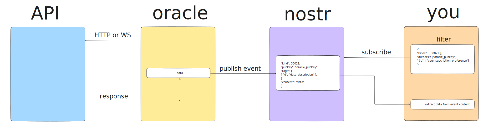

# Nostr Oracle

<!--  -->


Send event to nostr with data of APIs. Easly access and don't disturbe to APIs multiples times.

## Table of Contents

-   [Flow](#flow)
-   [Configuration](#configuration)
-   [Data Events](#data-events)
    -   [Remplazable data event](#remplazable-data-event)
    -   [Historical data event](#historical-data-event)
-   [To Do](#to-do)

## Flow

### Oracle

1. **Oracle** get data from **API**s.
2. **Oracle** create event with the data and publish to **Nostr** each X time.

### You

1. **You** subscribe with a filter to **Nostr**.
2. **You** get the data from the event and use it.



## Configuration

### 1. Setup environment variables

Copy `.env.example` to `.env` and fill the `NOSTR_PRIVATE_KEY` with random private key for sign events

> The public key is used to filter events.

```bash
cp .env.example .env
```

### 2. Setup

Use correct node version

```bash
nvm use
```

Install the dependencies

```bash
pnpm i
```

### 3. Run in dev mode

```bash
pnpm dev
```

## Data Events

Are two types of events:

-   Remplazable data: are parameterized replaceable, the relay must save the last event with the last update of the oracle. The oracle updates these events in a short period of time. For example: every 1 minute.
-   Historical data _(WIP)_: are regular, the relay save all events. The oracle updates these events in a long period of time. For example: every 1 hour.

## Remplazable data event

```json
{
    "id": <32-bytes lowercase hex-encoded sha256 of the serialized event data>,
  "pubkey": <32-bytes lowercase hex-encoded public key of the oracle>,
  "created_at": <unix timestamp in seconds>,
  "kind": 30021,
  "tags": [
      [
          "d",
        <string, information of the event data>
    ]
  ],
  "content": <string JSON enconde, data>,
  "sig":  <64-bytes lowercase hex of the signature of the sha256 hash of the serialized event data>
}
```

> KIND: 30021, parameterized replaceable event. More info in [NIP-01](https://github.com/nostr-protocol/nips/blob/master/01.md#kinds).

### D Tags

#### `btc:price`

-   About: Bitcoin price in USD from [yadio.io](https://yadio.io/).
-   Content:

    ```json
    "price": "<string>"
    ```

#### `btc:height` _(WIP)_

-   About: Bitcoin block height.
-   Content:

#### `btc:fee` _(WIP)_

-   About: Bitcoin fees in satoshi per byte.
-   Content:

#### `btc:difficulty` _(WIP)_

-   About: Bitcoin mining difficulty.
-   Content:

## Historical data event _(WIP)_

```json
{
  "id": <32-bytes lowercase hex-encoded sha256 of the serialized event data>,
  "pubkey": <32-bytes lowercase hex-encoded public key of the oracle>,
  "created_at": <unix timestamp in seconds>,
  "kind": 3021,
  "tags": [
    [
        "d",
        <string, information of the event data>
    ]
  ],
  "content": <string JSON enconde, data>,
  "sig":  <64-bytes lowercase hex of the signature of the sha256 hash of the serialized event data>
}
```

> KIND: 3021, regular event. More info in [NIP-01](https://github.com/nostr-protocol/nips/blob/master/01.md#kinds).

## To Do

-   [x] Function to get data from APIs
-   [x] Function to create event
-   [x] Function to send event to Nostr
-   [x] Improve README
    -   [x] Filter examples
-   [x] Use nostr-tools for conect to relays
-   [ ] Fix conection to multiple relays
-   [ ] Historical events (regular nostr events)
-   [ ] Other data events

---

Ideas for names:

-   Noracle
-   Nostracle

---

Made with :open_hands: by [Rapax](https://rapax.dev)

Tips are welcome through Lightning Zap to :zap:**rapax@lawallet.ar**.
